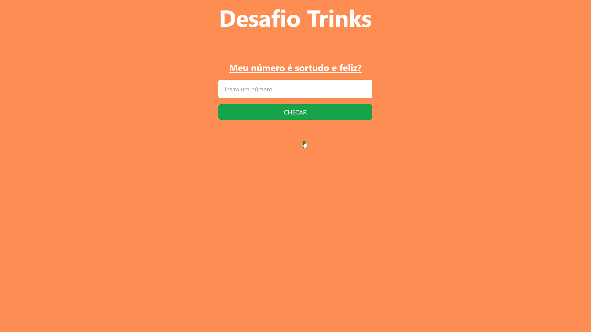

# Desafio #1 - Trinks

Um número é considerado feliz, se em algum ponto a soma de seus dígitos ao quadrado equivale a 1:

```
Ex: 7 é um número feliz? 
7² = 49 
4² + 9² = 97 
9² + 7² = 130 
1² + 3² + 0² = 10 
1² + 0² = 1 

Logo, 7 é um número feliz
```

Nós começamos com uma lista de inteiros começando em 1: 

```
[1,2,3,4,5,6,7,8,9,10,11,12,13,14,15,16,17,18,19,20,21,22,23,24,25]
```
Então removemos todos os números com posição múltipla de 2 (todos números pares), deixando todos os inteiros ímpares: 
```
[1, 3, 5, 7, 9, 11, 13, 15, 17, 19, 21, 23, 25]
```
O segundo termo desta sequência é 3. 
Nós removemos então todos os números com posição múltipla de 3 que sobraram na lista: 
```
[1, 3, 7, 9, 13, 15, 19, 21, 25]
```
O terceiro termo desta sequência é 7. 
Nós removemos então todos os números com posição múltipla de 7 que sobraram na lista: 
```
[1, 3, 7, 9, 13, 15, 21, 25]
```
Se nós repetirmos este procedimento indefinidamente, os sobreviventes são os números sortudos:
```
[1, 3, 7, 9, 13, 15, 21, 25]

Logo, 7 também é um número sortudo.
```
## Demonstração
[Trinks - Desafio 1](https://trinks-desafio.vercel.app)



## Rodando localmente

Clone o projeto

```bash
  git clone https://github.com/milfontariel/trinks-desafio.git
```

Entre no diretório do projeto

```bash
  cd trinks-desafio
```

Instale as dependências

```bash
  npm install
```

Inicie o servidor

```bash
  npm run dev
```

<br>

## Stack utilizada

**Front-end:** React, TailwindCSS, Vite

<br>

## Autores

- [@arielmilfont](https://www.github.com/milfontariel)

<br>

## Licença

[MIT](https://choosealicense.com/licenses/mit/)